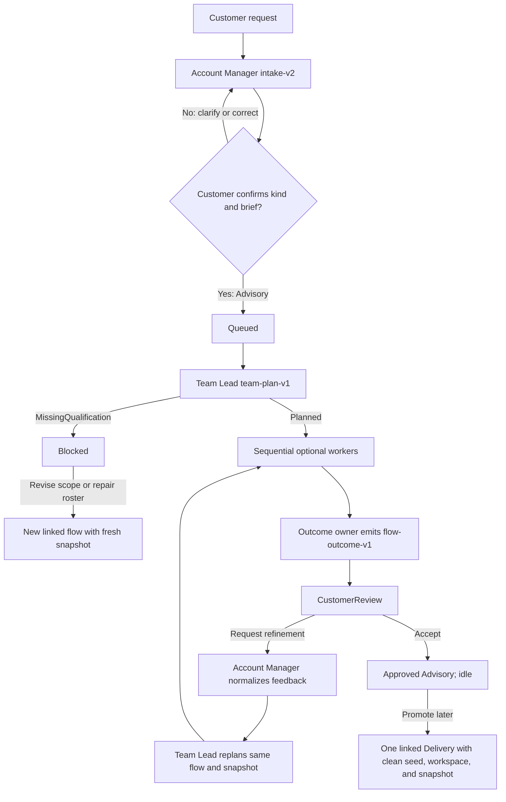
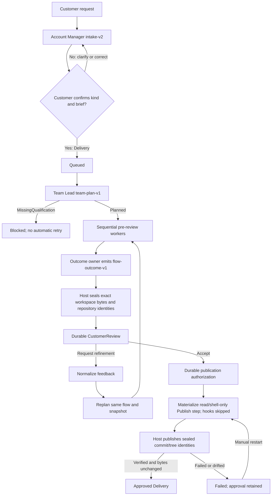

# AI Harness Studio

AI Harness Studio is a standalone .NET 10 application that turns a customer request into an
observable, durable multi-agent flow. It is an **independent .NET adaptation of selected OpenAI
Symphony ideas**, not a port, drop-in replacement, or claim of full Symphony conformance. Studio
uses GitHub Copilot CLI, SQLite, a React dashboard, and its own Advisory and Delivery product
lifecycle.

## Symphony-derived behavior and Studio-only extensions

| Symphony-derived behavior | AI Harness Studio adaptation |
| --- | --- |
| Repository-owned workflow contract | Root `WORKFLOW.md` contains typed YAML policy and a strict prompt template. |
| Last-known-good configuration | Valid workflow reloads replace the effective definition atomically. An invalid current file is diagnosed and blocks new-flow admission while already-snapshotted work can continue with the effective last-known-good definition. |
| One schedulable work item | One `FlowRun` owns one isolated workspace and consumes one concurrency slot, regardless of how many sequential plan steps it contains. |
| Authoritative orchestration | `WorkflowEngine` owns execution decisions. API handlers and coordinators request guarded state changes through `FlowLifecycleCoordinator`; UI and API representations are projections only. |
| Bounded dispatch and recovery | Active flow workers are bounded by `agent.max_concurrent_agents`; restart reconciliation recovers completed journal output, resumes interrupted attempts, and prevents duplicate semantic work. |
| Run attempts and sessions | `FlowStep` is the durable attempt record and stores its Copilot session, workflow revision, effective permissions, evidence, and causal retry links. |
| Per-work-item workspace | `WorkspaceManager` creates or recovers `data\worktrees\<flow-id>` and preserves it across retries and refinement iterations. |
| Hook lifecycle | `after_create`, `before_run`, `after_run`, and `before_remove` keep explicit failure semantics. Advisory guarded snapshots do not run repository hooks. |
| Human handoff | Customer review is durable SQLite state; no agent process waits for a browser response. |
| Trusted-host posture | Supported paths are strongly guarded, but Studio does not claim kernel-level or adversarial OS sandbox isolation. |

| Studio-only extension | What Studio adds |
| --- | --- |
| Advisory and Delivery flows | Advisory returns a reviewable recommendation without source writes or publication. Delivery changes an isolated workspace and publishes only after acceptance. |
| Customer intake | Account Manager classifies the flow kind and produces `intake-v2`; the customer must explicitly confirm it before execution. |
| Dynamic teams | Team Lead receives the exact enabled snapshot roster and emits `team-plan-v1`; no fixed C# role map selects v2 workers. |
| Immutable agent snapshots | Definition text, identity, hashes, required/switchable flags, and enabled state are captured once per flow. |
| Plan duties and outcome ownership | A plan declares dependencies, sequential order, duties, stages, and one final pre-review outcome owner. |
| Missing qualification | Team Lead can return a structured gap. Account Manager explains it once, then the flow becomes visibly `Blocked` with no retry timer. |
| Generic review and refinement | `CustomerReview` supports acceptance and same-flow refinement for either flow kind. |
| Linked promotion and repair | An accepted Advisory may create one linked Delivery; blocked work may create one roster-repair or scope-revision successor. Every successor receives a clean intake, workspace, and catalog snapshot. |
| Permission profiles | Host-enforced `ReadOnlySource`, `WorkspaceWrite`, `Publish`, and `PreMortemReadOnly` policy is independent of agent prose and identity. |
| Durable orchestration state | SQLite stores plans, snapshots, attempts, permissions, events, reviews, links, and publication authorization. |

## Agent definitions

Definitions are loaded atomically from `.github\agents\*.agent.md`.

| Definition | Requirement | Execution |
| --- | --- | --- |
| Account Manager | Required and non-switchable | Runs for intake and for refinement or missing-qualification explanation. |
| Team Lead | Required and non-switchable | Creates the dynamic downstream plan for every confirmed flow and every refinement iteration. |
| Pre-mortem Sceptic | Required definition, switchable execution | Its strict protocol is always startup-validated; Team Lead may schedule it only while it is enabled. |
| Any other definition, including Analyst | Optional and switchable | May be selected by exact snapshot `Id`; lifecycle correctness never depends on Software Engineer, Quality Engineer, Release Engineer, or Product Manager in `studio-v2`. |

A reload parses every file into a candidate catalog, publishes that catalog atomically only when all
required definitions are valid, and exposes invalid optional definitions for diagnostics without
making them selectable. **Reload catalog** calls the explicit reload API. Edits, deletion, or toggles
affect future flows only; a running flow executes only its immutable `FlowAgentSnapshot` rows.

## Lifecycle

### Advisory



### Delivery



Execution is deliberately sequential inside a flow. Dependencies define order and pushback
ownership, not parallel scheduling. Parallel fan-out/fan-in and integration joins are deferred.

## Durable contracts and recovery

- `team-plan-v1` is Team Lead's strict, bounded plan. It names arbitrary enabled snapshot agents,
  dependency IDs, ordered stages, `PlanDuty` values, one outcome owner, optional pre-mortem
  checkpoints, or a structured `MissingQualification`. External plan-step IDs are canonical
  lowercase kebab-case, case-fold unique, and cannot use host keys such as `team-plan` or the
  `account-manager:` / `pre-mortem:` namespaces.
- Every `studio-v2` worker receives the effective completed attempt for every direct dependency in
  declared order. The host uses a deterministic 3,200-character context envelope with a fair
  per-dependency allocation and explicit clipping markers; no direct dependency is dropped or
  replaced by an unrelated recent step. Ancestors are added only when the direct results fit.
- `flow-outcome-v1` is the outcome owner's strict customer-review result. Advisory may also declare
  bounded safe artifacts; Delivery normally declares no direct artifacts.
- Before a Delivery review opens, the host seals pending product bytes into deterministic local
  commits and persists a bounded `reviewed-candidate-v1` identity for every repository, scaffold
  file set, and preview. Publication metadata may change later, but reviewed product bytes may not.
- Advisory artifacts are materialized under iteration/outcome-hash-specific directories. Their
  directory, limits, outcome hash, and content digests are persisted with the review event, so
  accepted artifacts remain resolvable after `WORKFLOW.md` changes and older iterations stay
  auditable.
- One `(FlowRunId, Iteration)` `FlowPlanDocument` is immutable. Materialized worker and publication
  attempts retain a stable semantic root, so replay cannot create a second logical action.
- Restart reconciliation recovers contract-valid completed journal turns, marks interrupted turns
  resumable, and queues only executable states. `Blocked`, open `WaitingForFeedback`, `Approved`,
  `Abandoned`, and ordinary `Failed` flows remain idle.
- Linked `Intake` reconciliation also continues the existing canonical Account Manager attempt
  after a pending-step save, applies valid completed journal output, resumes a verified interrupted
  session, or leaves a visible failed/manual-retry state. It never creates a second intake step,
  customer message, gate, or queue event.
- Accepted Delivery review materializes or reuses exactly one publication root. Failed publication
  remains manual-restartable with its durable approval. Accepted Advisory remains idle and its
  promotion endpoint stays available and idempotent.
- Every attempt retains its persisted `WorkflowRevision` and effective permission document. A retry
  can adopt a current valid policy only by intersecting it with the original policy, so it can
  tighten but never silently regain permissions.
- Direct review buttons submit typed decisions without an agent turn. Free-text `/feedback` creates
  one request-hashed, visible Account Manager classification step in the existing isolated
  workspace, uses the immutable flow snapshot and `ReadOnlySource`, and parses strict
  `review-feedback-v1`. `Accept`, `RequestRefinement`, and explicit Advisory implementation
  adoption route through the same typed review coordinator; `Ambiguous` persists a customer-safe
  clarification without resolving the gate or changing status/iteration.
- The saved Delivery artifact setting accepts only `Commit` or `PullRequest`; `None` exists only on
  an Advisory `FlowRun` and is never offered as a persisted setting.
- `legacy-v1` active flows keep the static `FlowPlanner`, fixed-role behavior, and `Release` gates.
  When any migration snapshot exists, its identities, manifests, and enabled state also control
  legacy pre-mortem and Product Manager selection; the mutable global catalog is consulted only for
  explicit compatibility flows with no snapshot. Terminal legacy history needs no snapshot and
  remains readable. Studio never invents historical instructions or replans an active legacy flow
  under v2 rules. Explicitly reactivating a failed legacy flow captures the then-effective catalog
  once and records that migration limitation.

## Workflow and permissions

`WORKFLOW.md` is a strict Studio extension of the Symphony-style workflow file:

- the YAML shape and prompt variables are validated;
- the current-file status and effective last-known-good (LKG) revision are reported separately;
- invalid current configuration blocks admission but does not erase the effective LKG;
- each `FlowStep` persists its host-assigned lifecycle invocation, workflow revision, and effective
  permission before agent launch; authorization never branches on agent ID or display name; and
- `agent.max_concurrent_agents` means concurrent **FlowRuns**, not concurrent steps.

Supported profiles are deny-by-default:

| Profile | Intended use | Host policy |
| --- | --- | --- |
| `ReadOnlySource` | Intake, Team Lead, Advisory work, read-only analysis | Read/search tools only; source writes, shell, publishing, credentials, and custom MCPs are denied. |
| `WorkspaceWrite` | Delivery implementation, verification, and outcome preparation | Writes and local shell are confined to the isolated workspace; publication tools, destinations, and credentials remain blocked. |
| `Publish` | The one planned post-approval step | Read plus local shell only; no create/edit tools, source-mutating shell commands, inherited publication credentials, or workspace hooks. The host publishes only the pre-review sealed commit/tree identities after rechecking bytes before and after publication. |
| `PreMortemReadOnly` | Optional independent pre-mortem | Read/research only, different model family, bounded rounds, and no publication credentials. |

The host validates workspace containment, tool policy, publication credentials, durable approval,
the persisted pre-review candidate identity, and supported Git publication paths. These are strong supported-path controls
for a trusted host. They are **not** a kernel sandbox: a hostile same-user process that already knows
an out-of-band absolute path is outside this boundary.

## Run and validate

Prerequisites are .NET 10, Node.js 20.19+ (or 22.12+), Git, an authenticated GitHub Copilot CLI,
and Edge or Chrome for browser speech recognition.

```powershell
winget install GitHub.Copilot
copilot --version
copilot login

cd <clone-directory>
dotnet run --project .\src\AiHarnessDemo
# or
.\Start-Demo.ps1
```

Open `http://localhost:5283`.

All state is stored in `data\ai-harness.db`; flow workspaces are under the configured
`data\worktrees` root. The browser client is in `src\AiHarnessDemo\ClientApp` and Vite writes its
generated output to `src\AiHarnessDemo\wwwroot`.

```powershell
dotnet restore .\AiHarnessDemo.slnx
dotnet build .\AiHarnessDemo.slnx --no-restore
dotnet test .\AiHarnessDemo.slnx --no-build

Push-Location .\src\AiHarnessDemo\ClientApp
if (-not (Test-Path .\node_modules)) { npm ci }
npm run typecheck
npm test
npm run build
Pop-Location
```

See [`docs\ARCHITECTURE.md`](docs\ARCHITECTURE.md) for component, persistence, compatibility, and
recovery details. See [`THIRD-PARTY-NOTICES.md`](THIRD-PARTY-NOTICES.md) for Symphony attribution.
