# Architecture

## Symphony conformance map

| Symphony core | AI Harness Studio implementation |
| --- | --- |
| Repository-owned workflow contract | Root `WORKFLOW.md`, parsed strictly by `WorkflowLoader` and hot-reloaded with last-known-good behavior by `WorkflowDefinitionProvider`. |
| Policy / coordination / execution / integration / observability layers | `AiHarnessDemo.Core`, `WorkflowEngine`, reasoning hosts and workspaces, voice/Copilot adapters, API and browser dashboard. |
| Single scheduling authority | `FlowQueue`, `FlowWorker`, and `WorkflowEngine`; duplicate dispatch is rejected by the active-run map. |
| Bounded concurrency | Dynamic `agent.max_concurrent_agents` from `WORKFLOW.md`. |
| Transient recovery | Fresh-per-dispatch Polly retry pipeline with exponential backoff and jitter; dependency circuit breaker; queued-flow restart reconciliation. |
| Per-work-item workspace | One collision-resistant flow ID directory and Git branch; preserved between turns and iterations. |
| Workspace safety invariants | Absolute root containment check, sanitized key, and Copilot `cwd` equal to the flow workspace. |
| Workspace lifecycle hooks | `after_create`, `before_run`, `after_run`, and `before_remove` contracts in `WORKFLOW.md`. |
| Coding-agent runtime | `CopilotReasoningHost` runs every selected role through GitHub Copilot CLI. |
| Observable run state | SQLite step attempts, events, gate history, models, durations, prompt refinements, `/api/v1/state`, and per-flow routes. |
| Human handoff state | Release proposals stop at a customer gate; approval and execution state are intentionally separate. |

## Product flow

```mermaid
flowchart LR
    C[Customer voice or text] --> AM[Account Manager]
    AM -->|task-ready brief| TL[Team Lead]
    AM -->|material gap| C
    TL --> P[Dynamic agent plan]
    P --> A[Architecture and design]
    A --> E[Engineering]
    E --> Q[Quality gate]
    Q -->|pushback with exact gap| E
    Q --> R[Release Engineer]
    R --> V[Customer preview]
    V --> PM[Product Manager]
    PM -->|rework with retained context| TL
    PM -->|approve| X[Closed flow]
```

## Runtime components

| Component | Responsibility |
| --- | --- |
| `AgentCatalog` | Discovers valid Copilot agent definitions from `.github\agents`, synchronizes display metadata, and preserves enabled state in SQLite. |
| `RepositoryAnalyzer` | Runs `copilot init`, performs a bounded static repository study, and persists editable shared knowledge. |
| `IntakeCoordinator` | Persists customer dialogue and asks one material clarification at a time before creating a task-ready handoff. |
| `FlowPlanner` | Uses task complexity and domain signals to select only enabled specialists in dependency order. |
| `ModelSelector` | Routes each role to a model using task complexity and prior retry rate. |
| `FlowQueue` / `FlowWorker` | Recover queued work after restart and execute multiple independent flows concurrently. |
| `WorkflowEngine` | Drives the durable state machine, pre-creates visible pending stages, records every transition, enforces handoff gates, and learns from pushbacks. |
| `AgentRunner` | Runs every selected role through Copilot CLI with model routing, retries, progress events, and scrubbed tool-call audit. |
| `WorkspaceManager` | Creates one Git worktree and branch per flow so parallel tasks do not collide. |
| `FeedbackCoordinator` | Grounds Product Manager in the original request and full ledger, then closes or requeues the same flow with retained context. |
| `HarnessDbContext` | Persists settings, agents, flows, dialogue, steps, events, model choices, durations, outcomes, and prompt refinements. |

## Durable state

SQLite uses write-ahead logging for concurrent readers and short concurrent writes.

- `Settings`: selected repository, editable repository knowledge, and outcome.
- `Agents`: discovered role metadata and enabled state.
- `Flows`: one durable customer workflow per shareable URL.
- `FlowSteps`: agent, model, attempt, state, duration, output, and pushback reason.
- `FlowMessages`: voice/text dialogue with Account Manager and Product Manager.
- `FlowEvents`: append-only observable execution ledger.
- `Learnings`: cross-flow prompt refinements created from failed handoff contracts.

## Copilot CLI execution

- Requires Git and a selected Git work tree.
- Creates `ai-harness/<task>-<flow-id>` in an isolated worktree.
- Loads the generic agents from this project with `--add-dir`.
- Selects a model per role and launches non-interactive Copilot CLI execution.
- Gives each agent tool access inside its worktree; use only with repositories you trust.

## API shape

The browser uses a same-origin minimal API:

- `/api/bootstrap`, `/api/settings`, `/api/agents`
- `/api/directories`, `/api/repositories/analyze`
- `/api/intake`
- `/api/flows`, `/api/flows/{id}`, `/start`, `/feedback`, `/decision`
- `/api/history`, `/api/learnings`, `/api/previews/{id}`

The UI polls only active flows. Completed flows remain static and independently addressable through `#/factory/{id}`.
