# Architecture

## Symphony conformance map

| Symphony core | AI Harness Studio implementation |
| --- | --- |
| Repository-owned workflow contract | Root `WORKFLOW.md`, parsed strictly by `WorkflowLoader` and hot-reloaded with last-known-good behavior by `WorkflowDefinitionProvider`. |
| Policy / coordination / execution / integration / observability layers | `AiHarnessDemo.Core`, `WorkflowEngine`, reasoning hosts and workspaces, voice/Copilot adapters, API and browser dashboard. |
| Single scheduling authority | `FlowQueue`, `FlowWorker`, and `WorkflowEngine`; duplicate dispatch is rejected by the active-run map. |
| Bounded concurrency | Dynamic `agent.max_concurrent_agents` from `WORKFLOW.md`. |
| Transient recovery | Fresh-per-dispatch Polly retry pipeline with exponential backoff and jitter; dependency circuit breaker; completed-session journal recovery and explicit interrupted-session resume after restart. |
| Per-work-item workspace | One collision-resistant flow ID directory containing a matching branch and worktree for every project repository; preserved between turns and iterations. |
| Workspace safety invariants | Absolute root containment check, sanitized key, and Copilot `cwd` equal to the flow workspace. |
| Workspace lifecycle hooks | `after_create`, `before_run`, `after_run`, and `before_remove` contracts in `WORKFLOW.md`. |
| Coding-agent runtime | `CopilotReasoningHost` runs every selected role through GitHub Copilot CLI. |
| Role-focused prompting | The hot-reloaded workflow renders the current assignment first, compact repository facts, at most two immediate upstream handoffs for delivery roles, applicable learned constraints, and the role's completion contract. Retry diagnostics remain in durable events rather than agent prompts. |
| Observable run state | SQLite step attempts, events, gate history, models, durations, prompt refinements, `/api/v1/state`, and per-flow routes. |
| Human handoff state | Release proposals stop at a customer gate; approval and execution state are intentionally separate. |

## Product flow

```mermaid
flowchart LR
    C[Customer voice or text] --> AM[Account Manager]
    AM -->|clarification or proposed understanding| C
    C -->|correction| AM
    C -->|explicit confirmation| AM
    AM -->|customer-confirmed brief| TL[Team Lead]
    TL --> P[Dynamic agent plan]
    P --> A[Architecture and design]
    A -. optional Team Lead checkpoint .-> S[Pre-mortem Sceptic]
    S -->|evidence-backed findings| A
    S -->|clear or round cap| E
    A --> E[Engineering]
    E --> Q[Quality gate]
    Q -->|pushback with exact gap| E
    Q --> R[Release Engineer]
    R --> V[Customer preview]
    V --> PM[Product Manager]
    PM -->|rework with retained context| TL
    PM -->|approve| X[Closed flow]
```

## Runtime components

| Component | Responsibility |
| --- | --- |
| `AgentCatalog` | Discovers valid Copilot agent definitions from `.github\agents`, synchronizes display metadata, and preserves enabled state in SQLite. |
| `RepositoryAnalyzer` | Runs `copilot init`, discovers repository boundaries inside the selected project, performs a bounded static study, and persists editable shared knowledge. |
| `IntakeCoordinator` | Persists customer dialogue, separates clarification from confirmation, and queues only a customer-confirmed brief. |
| `FlowPlanner` | Uses task complexity and domain signals to select only enabled specialists in dependency order. |
| `ModelCatalogDiscovery` | Uses a dedicated bidirectional Copilot ACP process at startup to discover enabled explicit model + effort candidates and persist an audit snapshot. Current discovery is mandatory for readiness. |
| `BootstrapTaskProfileFactory` / Team Lead profiles | Create strictly validated, normalized `task-profile-v1` routing inputs. Team Lead gets one visible correction turn for an invalid downstream profile contract. |
| `PreMortemRules` / Pre-mortem Sceptic | Validate Team Lead's checkpoint plan, strict `CLEAR` or evidence-backed finding output, the five-finding cap, and the evaluated agent's adjustment disposition. |
| `AdaptiveModelRouter` | Applies router-v1 recency-weighted Bayesian evidence, risk quality floors, lexicographic strategy objectives, and bounded deterministic exploration immediately before execution. |
| `RoutingObservationRecorder` | Records normalized handoff quality, duration/retry, estimated premium use, availability failures, downstream pushback and targeted customer-rework attribution, and weak final approval evidence. |
| `PreviewArtifactCatalog` | Resolves validated per-variant static builds from the isolated flow workspace and exposes them only after the customer release gate is ready. |
| `FlowQueue` / `FlowWorker` | Reconcile persisted Copilot sessions before re-queuing work after restart, then execute multiple independent flows concurrently. |
| `WorkflowEngine` | Drives the durable state machine, pre-creates visible pending stages, records every transition, enforces handoff gates, and learns from pushbacks. |
| `AgentRunner` | Runs every selected role through Copilot CLI with model routing, bounded session-aware retries, progress events, and scrubbed tool-call audit. |
| `CopilotSessionJournal` | Reads Copilot CLI session journals, discovers legacy in-flight sessions by workspace and agent, and distinguishes completed, active, and interrupted turns. |
| `WorkspaceManager` | Creates one project workspace per flow, with an isolated worktree on the flow branch for every discovered repository. |
| `FlowAbandonmentService` | Blocks/cancels flow execution, stops workspace-owned processes, removes Copilot sessions, worktrees, previews, and flow branches, then retains the durable ledger as an abandoned learning record. |
| `FeedbackCoordinator` | Grounds Product Manager in the original request and full ledger, then closes or requeues the same flow with retained context. |
| `HarnessDbContext` | Persists settings, agents, flows, dialogue, steps, events, catalogs, profiles, routing decisions, normalized evidence, durations, outcomes, and prompt refinements. |

## Durable state

SQLite uses write-ahead logging for concurrent readers and short concurrent writes.

- `Settings`: selected project folder, editable repository knowledge, outcome, retry bound, and model-selection strategy.
- `Agents`: discovered role metadata and enabled state.
- `Flows`: one durable customer workflow per shareable URL, including its queued strategy snapshot.
- `FlowSteps`: agent, model + effort, attempt, state, duration, output, pushback reason, and durable pre-mortem origin/target/revision links.
- `FlowMessages`: voice/text dialogue with Account Manager and Product Manager.
- `FlowEvents`: append-only observable execution ledger.
- `Learnings`: cross-flow prompt refinements created from failed handoff contracts.
- `ModelCatalogSnapshots` / `ModelCatalogCandidates`: ACP discovery audit history.
- `TaskProfiles`, `RoutingDecisions`, `RoutingAlternatives`, `RoutingObservations`: normalized router-v1 state and evidence; no raw task or repository content.

## Copilot CLI execution

- Requires Git and a selected project folder containing at least one Git work tree.
- Resolves native and npm-installed Copilot CLI commands, skipping interactive Windows bootstrap
  shims and falling back to the latest app-managed native CLI when available.
- Creates the same `ai-harness/<task>-<flow-id>` branch in an isolated worktree for each project repository.
- Grants the flow workspace explicitly with `--add-dir`, sets it as Copilot's working directory, and tells agents that original source-folder paths are metadata rather than work targets.
- Loads the generic agents from this project with a separate `--add-dir`.
- Selects a discovered model + effort per step, always passes `--model`, and passes `--effort` when that model advertises configurable reasoning levels.
- Gives delivery agents only the two most recent completed handoffs in the current iteration; Product Manager receives the execution ledger required by its role.
- Gives each agent project access inside the isolated workspace; use only with repositories you trust.
- Classifies an explicit `PUSHBACK` before advance gating, records a revision request and reusable prompt refinement, resumes the responsible upstream Copilot session, then resumes the blocked agent with the corrected handoff.
- Interleaves Team Lead-selected pre-mortem checkpoints with delivery steps. A review excludes the evaluated step's model family, receives an enforced read-only source/web research toolset with publication credentials removed, and fails closed when the discovered catalog has no different enabled family.
- Feeds each evidence-backed pre-mortem result to the evaluated agent's original session. The agent returns a complete handoff plus an explicit adjusted/unchanged disposition; only adjusted results schedule another review.
- Applies the hot-reloadable five-minute quiet watchdog to Fastest response and Lowest cost. Maximum quality scales that window up to the configured fifteen-minute cap using predicted accepted time while retaining the hard per-turn timeout.
- Recovers a contract-valid final handoff from the Copilot session journal when the CLI does not shut down cleanly; otherwise only a confirmed interrupted journal is resumed on the next bounded runtime attempt.
- Keeps release preparation local until the customer resolves the release gate. Approval queues a distinct Release Engineer publication step; only that post-approval step may push and create the configured pull request.
- Applies the persisted Settings limit (`0-10`, default `2`) independently to each blocked handoff and each Team Lead-selected pre-mortem checkpoint. Pushback exhaustion is terminal; pre-mortem exhaustion advances with the latest complete adjusted result.

## API shape

The browser uses a same-origin minimal API:

- `/api/bootstrap`, `/api/settings`, `/api/agents`
- `/api/directories`, `/api/repositories/analyze`
- `/api/intake`
- `/api/flows`, `/api/flows/{id}`, `/start`, `/restart`, `/feedback`, `/decision`, `/abandon`
- `/api/history`, `/api/learnings`, `/api/previews/{id}`
- `/api/previews/{id}/artifacts/{variant}/{path}` serves the real isolated browser build used by the customer acceptance page.

The UI polls only active flows. Completed flows remain static and independently addressable through `#/factory/{id}`.

## Browser client

`src\AiHarnessDemo\ClientApp` is a React + TypeScript + Vite single-page app organized by feature page
(`factory`, `intake`, `flow`, `settings`, `history`, `memory`, `preview`) under `src\pages`, with a typed
API client/contracts layer in `src\api` and shared shell/utility code in `src\components`/`src\lib`.
[TanStack Query](https://tanstack.com/query) owns all server state, including the active-flow poll
(`useFlowQuery`'s `refetchInterval`, gated on flow status exactly like the original `scheduleFlowPoll`).
Routing uses React Router's `HashRouter` so that server-issued links such as `flow.outcomeUrl`
(`#/preview/{id}`) and every other shareable `#/...` URL keep working unchanged. Vite builds directly
into `wwwroot` (`vite.config.ts`: `build.outDir = "../wwwroot"`), and `AiHarnessDemo.csproj` runs
`npm ci`/`npm run build` before `Build`/`Publish` so `wwwroot` is always regenerated from
`ClientApp\src` — it is not hand-edited.
