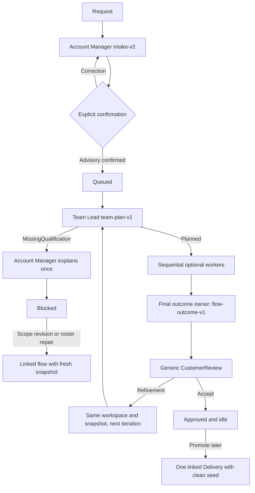
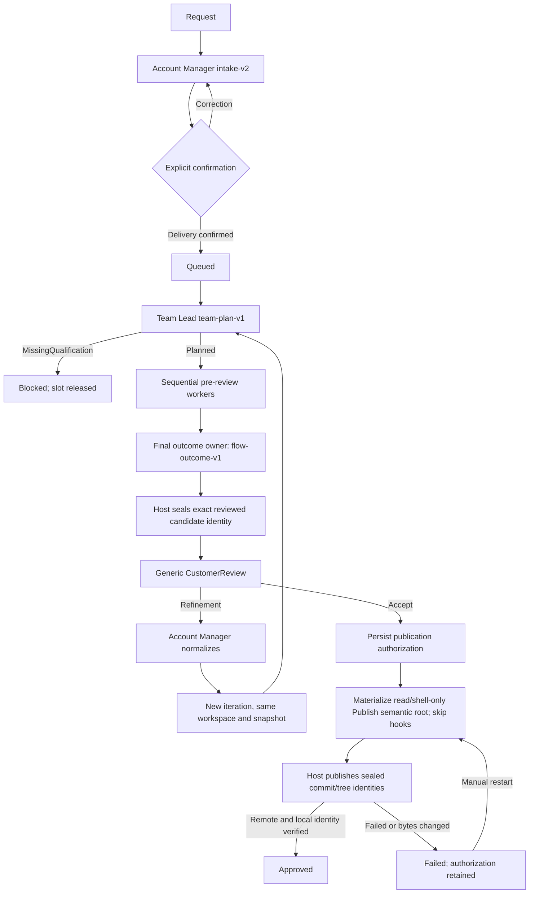

# Architecture

## Product boundary

AI Harness Studio is an independent .NET adaptation of selected orchestration behaviors described
by OpenAI Symphony. It is not a full Symphony implementation and does not claim conformance with
Symphony's tracker, runtime, or deployment model.

| Symphony-derived behavior | Studio implementation |
| --- | --- |
| Repository-owned workflow | Strict YAML and prompt template in `WORKFLOW.md`. |
| Atomic last-known-good reload | `WorkflowDefinitionProvider` separates current-file validity from the effective LKG definition. |
| One work item per workspace | A `FlowRun` owns one contained `WorkspaceManager` workspace. |
| Authoritative orchestrator | `FlowQueue`, `FlowWorker`, `WorkflowEngine`, and guarded `FlowLifecycleCoordinator` transitions. |
| Attempt/session recovery | `FlowStep`, deterministic session identity, `CopilotSessionJournal`, and restart reconciliation. |
| Bounded concurrency | `agent.max_concurrent_agents` limits concurrently executing flows, not plan steps. |
| Hooks | `after_create`, `before_run`, `after_run`, and `before_remove` retain explicit failure behavior. |
| Durable human handoff | A persisted review gate replaces any agent process waiting for a person. |
| Non-authoritative status view | ASP.NET API and React render SQLite state; they do not advance it independently. |

| Studio-only extension | Architectural consequence |
| --- | --- |
| Advisory and Delivery kinds | The flow kind determines workspace mode, duty validation, review actions, and publication eligibility. |
| Account Manager intake | `intake-v2` and explicit confirmation precede dispatch. |
| Dynamic Team Lead plan | `team-plan-v1` selects arbitrary enabled snapshot agents; v2 never calls `FlowPlanner`. |
| Immutable definition snapshots | `FlowAgentSnapshot` is the sole execution source after flow creation. |
| Duties, stages, and outcome owner | Permission and lifecycle decisions use plan metadata rather than fixed role names. |
| Missing qualification | A structured blocker and one customer-safe explanation end in `Blocked` without a timer. |
| Generic customer review | `CustomerReview` supports acceptance, refinement, and Advisory promotion. |
| Linked flows | Promotion, roster repair, and scope revision create constrained successors with new workspaces and snapshots. |
| Permission profiles | The host—not manifest prose—derives and persists the effective tool and publication policy. |
| SQLite orchestration ledger | Plans, snapshots, attempts, events, reviews, links, and publication authorization survive restart. |

## Agent catalog

`AgentCatalogLoader` parses `.github\agents\*.agent.md` into an in-memory candidate. `AgentCatalog`
publishes it atomically only after required-definition validation succeeds and exposes both catalog
readiness and the last error through the API.

| Agent | Definition rule | Runtime rule |
| --- | --- | --- |
| Account Manager | Required | Non-switchable; handles intake, refinement normalization, and customer-safe blocker explanations. |
| Team Lead | Required | Non-switchable; creates every v2 downstream plan. |
| Pre-mortem Sceptic | Required definition | Execution is optional/switchable; when selected, strict output, model-family separation, and round bounds apply. |
| Analyst and every other agent | Optional | Arbitrary IDs are selectable only when valid and enabled in the captured flow snapshot. |

Malformed optional definitions remain visible with diagnostics but are not selectable. Missing,
empty, or malformed required definitions make the current catalog unready. Operators can call the
explicit `/api/agent-catalog/reload` route after repairing files. A failed reload leaves the prior
effective catalog available only to already-snapshotted work; new-flow admission remains closed.

Creating a `studio-v2` flow captures name, description, role, instructions, definition hash, enabled
state, required/switchable policy, source filename, timestamp, and catalog revision. Later file
edits, deletion, reloads, and toggles never refresh that flow. An active `legacy-v1` row receives a
one-time startup snapshot with an event documenting that historical limitation; terminal legacy
rows remain readable without one.
If a failed terminal legacy flow is explicitly restarted, Studio captures the then-effective
catalog once, records that migration limitation, and still executes the legacy planner; it never
converts or replans the row as `studio-v2`.

## Workflow contract

Root `WORKFLOW.md` is a strict Studio extension of the Symphony-style contract:

- YAML is typed; unknown `studio` fields and invalid policy combinations are rejected.
- Prompt variables are strict and missing values fail closed.
- File reload is atomic. `CurrentFileValid` describes the file now on disk;
  `HasEffectiveDefinition` and `EffectiveRevision` describe the last valid definition retained in
  memory.
- Current invalidity blocks new-flow admission. Existing snapshotted attempts may continue against
  the effective LKG.
- Every `FlowStep` stores `WorkflowRevision`, `PermissionProfile`, and the serialized
  `EffectivePermissionJson` before Copilot CLI launch.
- A resumed attempt reuses that exact permission document and revision. A newly-created retry starts
  from the prior attempt's policy and may intersect it with a current valid policy only when the
  result is stricter. It never gains a tool, URL, credential, write, or publish capability silently.
- `agent.max_concurrent_agents` is retained for compatibility but means concurrent `FlowRun`
  workers. Steps within one flow remain sequential.

## Lifecycle ownership

`FlowLifecycleCoordinator` serializes mutation commands per flow and validates state edges. Invalid
edges throw `FlowLifecycleException`; `ApiExceptionHandler` maps it to HTTP 409.

Principal transitions are:

```text
Intake -> Queued
Queued | Reworking -> Running
Running | Reworking -> WaitingForFeedback | Blocked | Failed
WaitingForFeedback -> Queued | Reworking | Approved
Failed -> Queued                  (explicit manual restart only)
active or Blocked -> Abandoning -> Abandoned
Running -> Approved               (verified post-approval publication)
```

Restart has one additional guarded operation, `Running | Reworking -> Queued`, used only after
interrupted attempts have been reconciled. API handlers and coordinators do not assign
`FlowRun.Status` directly. Step state plus append-only `FlowEvent` entries make execution,
materialization, recovery, review, failure, and cleanup visible.

### Advisory lifecycle



Advisory uses a guarded copied source snapshot. Snapshot ownership is journaled before the atomic
final move, so restart can adopt only a matching flow/source-baseline orphan and never arbitrary
content. Abandonment repeats the metadata/nonce/marker/baseline ownership check before recursive
deletion; an unowned or changed deterministic-path collision is preserved and recorded as a
cleanup diagnostic. Hooks, source mutation, shell tools, publication credentials, and remote publication are
disabled. Declared text/Markdown/CSV/JSON artifacts are host-materialized only after a byte-for-byte
baseline check. Each materialization uses an iteration/outcome-hash-specific directory and persists
its directory, limits, outcome hash, and per-file identity; discovery never reinterprets an accepted
outcome with the current `WORKFLOW.md`. Historical `advisory-artifacts-v1` events are adapted only
as typed read-only policies, preserving their legacy artifact-root layout without allowing new v2
materializations to use that layout.

### Delivery lifecycle



There is no v2 lifecycle dependency on `software-engineer`, `quality-engineer`,
`release-engineer`, or `product-manager`. Those names remain legitimate optional catalog entries
and remain part of the `legacy-v1` pipeline, prompts, and historical records.

## Dynamic contracts

### `team-plan-v1`

Team Lead receives the confirmed brief and the exact enabled optional snapshot roster as `Id`,
`Name`, and `Description`. The strict document contains:

- one or more ordered `BeforeReview` steps for a valid plan;
- exact snapshot `AgentId` values, with repeated agent IDs allowed under distinct step IDs;
- canonical lowercase kebab-case plan-step IDs with case-insensitive uniqueness; `team-plan`,
  `account-manager:...`, and `pre-mortem:...` are host-reserved and rejected;
- acyclic dependencies on lower-order steps;
- bounded assignment and justification text;
- `PlanDuty` values (`Analyze`, `Design`, `Implement`, `Verify`, `PrepareOutcome`, `Publish`);
- `PlanStage` (`BeforeReview` or `AfterApproval`);
- one final pre-review outcome owner with `PrepareOutcome`;
- bounded task profiles and optional pre-mortem checkpoints; and
- either `Planned` or an exact `MissingQualification` document.

Delivery requires implementation, verification, outcome preparation, and exactly one
`AfterApproval` Publish-only step. Advisory forbids Implement, Publish, and AfterApproval. Only
pre-review steps are initially materialized. Execution follows the deterministic order one step at
a time; fan-out/fan-in and an integration join are explicitly deferred. Before each v2 worker
attempt, the engine resolves the accepted plan's declared dependency graph and selects the latest
effective completed attempt for every direct dependency, including retries and revisions. The
prompt host gives every direct result a fair bounded allocation with an explicit clipping marker,
adds ancestors only when space remains, and never substitutes unrelated recent output.

### `flow-outcome-v1`

The declared outcome owner returns one normalized customer-facing goal, summary, and bounded
implementation-detail list. Advisory may declare bounded safe artifacts. The result is the durable
source for `CustomerReview` and for the clean promotion seed.

`MissingQualification` persists an operator-facing summary, exact gaps, rationale, and suggested
agent. Account Manager runs once to create a distinct customer-safe message. The parent then remains
immutable and `Blocked`; repair actions create a linked flow rather than mutating or retrying it.

## Review, refinement, and links

`HandoffGateRecord` stores the generic review and typed `ReviewDecision`.

- Direct buttons are already typed and never invoke Copilot. Free-text feedback is request-hashed
  against the current gate/iteration and classified once by the snapshotted Account Manager in the
  existing isolated workspace. The visible step has the host-owned `ReviewClassification`
  invocation and `ReadOnlySource`; malformed `review-feedback-v1` receives one bounded correction
  before failing closed. An ambiguous result persists only the safe clarification and leaves the
  gate, status, and iteration unchanged.
- Advisory acceptance ends the flow without publication.
- Advisory refinement increments the same flow iteration and reuses its workspace and snapshot.
- Advisory promotion atomically accepts the reviewed result and creates at most one linked Delivery
  for `(parent, iteration, AdvisoryPromotion)`.
- Delivery refinement also reuses the flow workspace and snapshot.
- Delivery acceptance is durable authorization; only then is the one planned Publish semantic root
  materialized.

### Host-derived Delivery readiness

`studio-v2` Delivery flows carry a separate host-owned readiness aggregate. It is the only
authorization input for review, waiver, acceptance, publication, and final approval; agent prose and
`HANDOFF_STATUS: COMPLETE` are display and diagnostics only.

- The Team Lead's Delivery `team-plan-v1` must declare `AcceptanceCriteria` (`DeliveryAcceptancePlan`,
  stable `AC-000` ids). The host hashes the plan and persists it as
  `delivery.acceptance-plan-recorded`.
- The plan step with the `Verify` duty must return a strict `outcome-qa-v2` document. The host
  injects the exact acceptance plan hash, the planned criteria, and the host-issued evidence
  registry into that turn's assignment, then validates exhaustive criterion coverage, exact enum
  casing, duplicate properties, bounds, evidence-identifier membership, and risk classification,
  derives the verdict itself, and persists the exact bytes as `delivery.readiness-qa-recorded`. An
  invalid contract fails the turn closed.
- Evidence identifiers are host-owned. Each completed `BeforeReview` worker step, and the
  verification step itself before dispatch, records `delivery.readiness-evidence-recorded` with
  deterministic `EV-Snnn-nnn` identifiers derived from the host execution record and its observed
  tool calls. Membership in that registry is mandatory, so a fabricated identifier can never
  authorize a verified criterion and an empty registry fails closed.
- After the candidate is sealed, `DeliveryReadinessPolicy` derives one of `ReadyToApprove`,
  `NeedsCustomerWaiver`, `NeedsRefinement`, or `Blocked` in that precedence and writes an immutable
  `DeliveryReadinessSnapshotRecord` bound one-to-one to a `ReviewedCandidateRecord`. Unique partial
  indexes allow exactly one active snapshot and one active reviewed candidate per flow.
- `WorkflowEngine` opens an ordinary `CustomerReview` only for `ReadyToApprove`. A
  `NeedsCustomerWaiver` result opens the separate `CustomerWaiver` gate; `NeedsRefinement` and
  `Blocked` open no customer gate at all and record a typed blocker.
- `POST /api/flows/{flowId}/readiness-waiver` records immutable `ReadinessWaiverRecord` receipts for
  the exact enumerated `WaiverRequired` risk ids, then re-derives the same QA facts and opens the
  ordinary review. Acceptance criteria and `Blocking` risks are schema-invalid waiver targets.
- Review, waiver, and publication requests carry `reviewedCandidateId`, `readinessRevision`, and
  `readinessContractHash`. For a Delivery readiness flow all three are mandatory; an omitted value
  is a stale tab and returns `readiness.review-stale`. A stale or non-ready binding returns an
  RFC 9457 `409` with a stable `code` (`readiness.not-ready`, `readiness.waiver-required`,
  `readiness.waiver-not-applicable`, `readiness.candidate-stale`, `readiness.review-stale`,
  `readiness.reconciliation-required`, `readiness.publication-not-authorized`) and never resolves a
  gate.
- `POST /api/flows/{flowId}/readiness-resolution` is the typed way out of a non-releasable state.
  `NeedsRefinement` accepts only `RequestRefinement` (queues a new iteration); `Blocked` accepts
  `Continue` (re-queues the same iteration), `Replan` (new iteration), or `Abandon` (delegated to
  the durable abandonment service). Every resolution supersedes the active readiness snapshot and
  candidate binding, and none of them can accept a result, grant a waiver, or resolve a gate.
- `LoadCurrentAsync` rejects a readiness row whose persisted state or hash disagrees with its
  canonical contract JSON, so durable state edited outside the derivation path fails closed.
- Restart reconciliation never transitions a studio-v2 Delivery flow to `Approved` directly. A
  publication that completed inside the crash window is reauthorized against the current readiness,
  accepted review, and journal binding and then completed through `CompletePublishedDelivery`;
  otherwise a denial event is recorded and the flow stays unapproved.
- `VerifiedCandidatePublisher` re-reads the readiness rows before any token lookup, Git command, or
  journal mutation, stamps `ReviewedCandidateId`, `ReadinessSnapshotId`, `ReadinessContractHash`,
  `CustomerReviewGateId`, and `WaiverSetHash` onto every `ReviewedPublicationRecord`, and
  `PublishedOutcomeVerifier` rechecks the same binding after remote verification.
- `FlowLifecycleCoordinator.Transition` refuses `Approved` for a `studio-v2` Delivery flow.
  `OpenWaiverReview`, `OpenCustomerReview`, `QueueApprovedPublication`, and
  `CompletePublishedDelivery` are the only guarded paths, and each requires the derived state plus an
  exact candidate binding.
- Startup reconciliation is fail-closed and idempotent: a pre-readiness `studio-v2` Delivery flow
  with review history gains a `LegacyUnverified` snapshot, any unresolved review is superseded, and
  the projection renders **Published - readiness unverified** under `Blocked` instead of green.
- The exact candidate is sealed before the review gate: all repository HEAD/tree identities plus
  bounded scaffold/preview identity are persisted as `reviewed-candidate-v1`, tied to flow,
  iteration, outcome owner, plan-step key, and outcome-contract hash.
- Delivery preview metadata is projected from the verified preview manifest, and file responses
  recheck the requested length and digest before serving an in-memory copy. Missing, stale, or
  mutated reviewed-candidate identity returns a conflict without file bytes.
- While a studio Delivery is awaiting its unresolved review, the detail projection exposes a
  distinct `ReviewedPreviewUrl` only after current seal verification finds a renderable preview.
  The UI labels it **Open reviewed preview**. After approval it disappears; the separately verified
  published `OutcomeUrl` remains labelled as the published outcome.
- The studio-v2 Publish Copilot turn has no create/edit tools, receives only read plus the local
  shell needed for packaging inspection, denies supported source-mutating commands, receives no
  publication credentials, and runs no workspace hooks. Free-text review classification likewise
  suppresses every workspace hook and verifies the reviewed candidate before and after its
  read-only turn. The trusted host—not the agent—pushes the sealed commits and creates PR metadata,
  then rechecks the same candidate bytes.
- Failed publication retains authorization and is retried only through explicit manual restart.

Promotion transfers only a bounded `advisory-promotion-seed-v1` containing the accepted goal and
implementation details. It does not copy messages, tools, sessions, steps, plan documents, events,
or the parent workspace. The child runs normal Account Manager and Team Lead stages with a fresh
snapshot and workspace. On the first promoted-child turn only, Account Manager may confirm directly
when the host validates Delivery kind, exact goal, and the complete normalized implementation-detail
ordered list against the durable seed; any one-character or ordering drift fails closed. The
canonical seed accepts the complete bounded `flow-outcome-v1` goal plus all 24 implementation
details. To stay within the Copilot CLI command-line envelope, the host stages that canonical JSON
once in the session's read-only context root and places only its path and SHA-256 identity in the
prompt; model output is still parsed and host-validated, so the file is never a success fallback.
Startup reconciliation finds a linked Intake child with no attempt or with its canonical initial
Account Manager step still `Pending`/`Running`. It creates no replacement step: pending work follows
normal intake, a valid completed journal is applied, an interrupted deterministic session is
resumed, and missing/invalid journal state becomes a visible manual-retry failure. Qualification
roster repair and scope revision use the same clean-successor rule. SQLite uniqueness constraints
and guarded coordinators make repeated requests idempotent. A scope revision child additionally
stores the normalized request hash; an identical replay returns that child, while a materially
different request conflicts because the parent iteration can have only one successor of that link
kind.

The old `/feedback` and `/decision` routes and legacy DTO fields remain. For `studio-v2` they are
compatibility wrappers over generic review behavior; for `legacy-v1` they retain Product Manager and
`Release`-gate semantics.

## Permission boundary

| Profile | Allowed purpose | Important denials |
| --- | --- | --- |
| `ReadOnlySource` | Intake, planning, review classification, blocker explanation, Advisory workers, read-only analysis | No writes, shell, publication tools, custom MCPs, or publication credentials. |
| `WorkspaceWrite` | Delivery implementation, verification, local outcome preparation | Isolated-workspace write/shell only; supported remote-publish commands, destinations, and credentials denied. |
| `Publish` | One accepted Delivery's planned Publish step | Requires a durable accepted `CustomerReview`, exact plan-step key, AfterApproval stage, Publish-only duty, and matching `reviewed-candidate-v1`; create/edit, supported mutation commands, credentials, remote tools, and workspace hooks are withheld from Copilot while the host performs exact-object publication. |
| `PreMortemReadOnly` | Optional pre-mortem | Read/search/research only, no write/shell/publish, and a different model family from the reviewed step. |

Manifest frontmatter and instructions cannot grant capabilities. The host persists an explicit
`ExecutionInvocationKind` (`Intake`, `Planning`, `Worker`, `PreMortem`,
`ReviewClassification`, `BlockerExplanation`, or `Publication`) and derives policy from that
host-owned lifecycle value plus flow kind, stage, duties, and durable review state. Agent IDs and
display names remain audit/session identity only and are never authorization inputs. The host then
applies workflow ceilings and additional deny rules.
Publication credentials are separated from all non-publish turns. Deny-by-default CLI arguments,
workspace containment, guarded Git metadata, immutable candidate identity, and exact-target host
publication provide strong enforcement on supported paths.

This remains a trusted-host design, **not** kernel or adversarial OS sandbox isolation. Without a
separate OS identity or sandbox, a hostile same-user process that already knows an authoritative
absolute path may bypass application-level path discovery controls.

## Durable state and restart reconciliation

SQLite runs in write-ahead logging mode. Core durable tables are:

- `Flows`: lifecycle, kind, contract version, lineage, blockers, workspace, outcome, and timestamps.
- `FlowAgentSnapshots`: immutable per-flow execution definitions.
- `FlowPlanDocuments`: one accepted plan per flow iteration.
- `FlowSteps`: sequential attempts, stable semantic roots, sessions, workflow revisions, effective
  permissions, status, evidence, and retry links.
- `GateRecords`: generic customer review, legacy release, and outcome-resolution decisions.
- `ReviewedPublicationRecords`: one row per reviewed studio-v2 publication repository, holding the
  publication root, reviewed fingerprint, remote repository, branch, head/tree, pull request URL,
  and the stage reached (`Intent`, `BranchPublished`, `PullRequestOpened`, `Completed`).
- `FlowEvents`: append-only status, materialization, recovery, and failure evidence.
- `FlowMessages`, `TaskProfiles`, routing tables, tool calls, outcomes, and learnings.

At startup, `CopilotSessionJournal` and `WorkflowEngine` reconcile:

| Durable case | Recovery action |
| --- | --- |
| Completed valid journal attempt | Complete the existing `FlowStep` once and continue downstream. |
| Interrupted resumable attempt | Stop only a verified orphan process, retain the session ID, reset the same attempt to pending, and queue it once. |
| Linked Intake with a pending initial Account Manager step | Execute that exact durable step once through the normal intake coordinator. |
| Linked Intake with a running initial Account Manager step | Apply a current valid journal result, resume the verified interrupted session, or record a visible manual-retry failure. |
| Failed attempt | Stay `Failed` until explicit manual restart. |
| Open MissingQualification | Stay `Blocked`; do not run Account Manager again and do not schedule a timer. |
| Open customer review | Stay `WaitingForFeedback`; do not recreate or enqueue the review. |
| Accepted Delivery without publication materialization | Recreate the one planned publication root from the durable review and queue it. |
| Failed accepted publication | Stay `Failed`; preserve authorization and semantic root for manual restart. |
| Interrupted reviewed publication | Re-read `ReviewedPublicationRecords` and the publication events first, reconcile the remote branch head with `git ls-remote` and the pull request identity across open, closed, and merged states, then finish only the repositories that are not yet `Completed`. |
| Accepted Advisory | Stay idle and keep idempotent promotion available. |
| Active `legacy-v1` | Requeue on its static planner/release path using its migration-time snapshot. |
| Terminal `legacy-v1` | Remain readable without requiring a snapshot. |

Reconciliation never refreshes a v2 snapshot, invents historical instructions, creates another
accepted plan, review, publication root, or linked successor, retries missing qualification, or
runs two attempts for one flow. `FlowWorker` and `WorkflowEngine` both deduplicate execution claims.
A blocked flow returns from `RunAsync`, releasing its concurrent-flow slot.

## Runtime components

| Component | Responsibility |
| --- | --- |
| `NewWorkAdmissionService` | Requires current workflow/catalog readiness and a configured studied project before creating work. |
| `AgentCatalog` / `FlowAgentSnapshotService` | Atomic definitions, diagnostics, explicit reload, and immutable per-flow execution source. |
| `IntakeCoordinator` | Executes Account Manager intake and applies the confirmation gate. |
| `TeamPlanValidator` | Strict plan parsing, roster/dependency/duty/stage/outcome-owner validation, and MissingQualification validation. |
| `FlowLifecycleCoordinator` | Per-flow mutation lock plus typed transition guard. |
| `WorkflowEngine` | Sequential orchestration, materialization, execution, handoffs, review readiness, recovery, and legacy routing. |
| `FlowQueue` / `FlowWorker` | Dispatch independent flows and deduplicate queued/running work. |
| `ReviewCoordinator` | Generic acceptance, same-flow refinement, publication materialization, and Advisory promotion. |
| `MissingQualificationCoordinator` | One explanation attempt and durable blocking. |
| `LinkedFlowCoordinator` | Clean, uniquely linked successors and normal child intake. |
| `CopilotReasoningHost` | Snapshot instructions, strict workflow prompt, persisted permissions, CLI execution, and session recovery. |
| `WorkspaceManager` | Deterministic guarded snapshots or Delivery worktrees, containment, recovery, hooks, and cleanup. |
| `FlowAbandonmentService` | Guarded `Abandoning` transition, process/session/workspace cleanup, then durable `Abandoned`. |

## Local commands

Run from the repository root on Windows:

```powershell
dotnet restore .\AiHarnessDemo.slnx
dotnet build .\AiHarnessDemo.slnx --no-restore
dotnet test .\AiHarnessDemo.slnx --no-build

Push-Location .\src\AiHarnessDemo\ClientApp
if (-not (Test-Path .\node_modules)) { npm ci }
npm run typecheck
npm test
npm run build
Pop-Location
```
